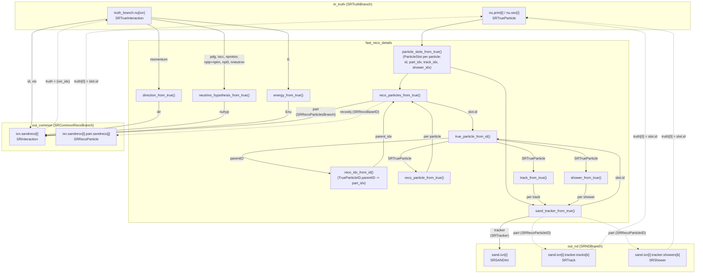

# fast_reco

Reads the `SRTruthBranch` produced by `truth_filler` and produces `SRCommonRecoBranch`
(`out_common`) and `SRNDBranch` (`out_nd`) for downstream CAF consumers (`caf_streamer`,
`gauss_smearing`/`gluckstern_smearing`). "Perfect" reco: every field is copied/derived
1:1 from truth, no smearing — `gauss_smearing`/`gluckstern_smearing` perturb this output
afterwards.

## Data flow

(dashed arrows: cross-reference links, not data copies — `recoobj`/`part` are the
bidirectional `SRRecoParticle` ↔ `SRTrack`/`SRShower` link, `truth` is the reco→truth
link, both `TrueParticleID`/`SRRecoBaseID`/`SRRecoParticleID`, not nested objects)

---

## 1. `caf::SRInteraction` — the reconstructed neutrino vertex

Stored in `common_reco_branch.ixn.sandreco[i]`. Filled directly in `fast_reco::run()`,
one per `truth_branch.nu[i]`.

| Field | Type | Source | Notes |
|-------|------|--------|-------|
| `id` | `long int` | `true_ixn.id` | |
| `vtx` | `SRVector3D` | `true_ixn.vtx` | Copied, no smearing |
| `dir` | `SRDirectionBranch` | `direction_from_true(true_ixn)` | See §2 |
| `nuhyp` | `SRNeutrinoHypothesisBranch` | `neutrino_hypothesis_from_true(true_ixn)` | See §3 |
| `Enu` | `SRNeutrinoEnergyBranch` | `energy_from_true(true_ixn)` | See §4 |
| `part` | `SRRecoParticlesBranch` | `reco_particles_from_true(true_ixn, ixn_idx)` | See §5 |
| `truth` | `vector<size_t>` | `{ixn_idx}` | Index into `truth_branch.nu` |
| `truthOverlap` | `vector<float>` | `{1.0}` | Perfect reco: 100% overlap |

**Filled:** 8 fields. **Not filled** (left at default): `preselected` (`false`),
`isFromTrigger` (`true` — correct default, SAND has no cosmic-overlay concept yet).

---

## 2. `caf::SRDirectionBranch` (`SRInteraction::dir`)

Filled by `direction_from_true()`. All four estimators collapse to the same value —
a deliberate choice, not a placeholder: since this is a "perfect" reco, every field is
a copy of the truth, not a value derived bottom-up from reconstructed particles.

| Field | Source |
|-------|--------|
| `calo` | `normalize(true_ixn.momentum)` |
| `heshw` | `normalize(true_ixn.momentum)` |
| `lngtrk` | `normalize(true_ixn.momentum)` |
| `part_mom_sum` | `normalize(true_ixn.momentum)` |

**Filled:** 4/4 fields.

---

## 3. `caf::SRNeutrinoHypothesisBranch` / `SRCVNScoreBranch` (`SRInteraction::nuhyp.cvn`)

Filled by `neutrino_hypothesis_from_true()` — a "perfect classifier": one-hot encoding
on the true class instead of a network score.

| Field | Source |
|-------|--------|
| `isnubar` | `1` if `true_ixn.pdg < 0` else `0` |
| `nc` | `1` if `!true_ixn.iscc` else `0` |
| `nue` / `numu` / `nutau` | `1` for the flavor matching `|true_ixn.pdg|` when `iscc`, else `0` |
| `protons0`/`1`/`2`/`N` | One-hot bucket ({0,1,2,≥3}) of `true_ixn.nproton` |
| `chgpi0`/`1`/`2`/`N` | One-hot bucket of `true_ixn.npip + true_ixn.npim` |
| `pizero0`/`1`/`2`/`N` | One-hot bucket of `true_ixn.npi0` |
| `neutron0`/`1`/`2`/`N` | One-hot bucket of `true_ixn.nneutron` |

**Filled:** 21/21 fields.

---

## 4. `caf::SRNeutrinoEnergyBranch` (`SRInteraction::Enu`)

Filled by `energy_from_true()`. Same "perfect reco" choice as `dir`: every estimator
collapses to `true_ixn.E`.

| Field | Source |
|-------|--------|
| `calo`, `lep_calo`, `mu_range`, `mu_mcs`, `mu_mcs_llhd`, `e_calo`, `e_had`, `mu_had`, `regcnn`, `part_energy_sum` | `true_ixn.E` |

**Filled:** 10/10 fields.

---

## 5. `caf::SRRecoParticle` — one per primary/secondary

Stored in `common_reco_branch.ixn.sandreco[i].part.sandreco[j]`, one per
`true_ixn.prim`/`true_ixn.sec` entry. Filled by `reco_particle_from_true()`
(+ `recoobj`/`parent`/`daughters` set in `reco_particles_from_true()`).

| Field | Type | Source | Notes |
|-------|------|--------|-------|
| `primary` | `bool` | `id.type == TrueParticleID::kPrimary` | |
| `pdg` | `int` | `true_part.pdg` | |
| `score` | `float` | Hardcoded `1.0` | Perfect PID |
| `E` | `float` | `true_part.p.E` | **GeV** |
| `p` | `SRVector3D` | `{true_part.p.px, py, pz}` | **GeV/c** |
| `start` | `SRVector3D` | `true_part.start_pos` | **cm** |
| `end` | `SRVector3D` | `true_part.end_pos` | **cm** |
| `origRecoObjType` | `RecoObjType` | `kTrack`/`kShower` from PDG classification, else `kUnknownRecoObj` | See §8 |
| `parent` | `int` | Index of the parent's `SRRecoParticle` in the same `part.sandreco`, via `true_part.parentID` | `-1` if no parent (primaries) |
| `daughters` | `vector<unsigned int>` | Reverse of `parent`: this particle's index, pushed onto its parent's `daughters` | |
| `truth` | `vector<TrueParticleID>` | `{id}` | `id = {ixn_idx, kPrimary\|kSecondary, i}`, **not** `true_part.ancestor_id` (see fast_reco/PLAN.md) |
| `truthOverlap` | `vector<float>` | `{1.0}` | |
| `recoobj` | `SRRecoBaseID` | `{ixn_idx, kSANDTrackerTrack\|kSANDTrackerShower, slot.track_idx\|shower_idx}` | Only for track-/shower-like PDGs; unset (`kUnknown`) otherwise |

**Filled:** 13/17 fields. **Not filled** (rimandati per scelta, vedi PLAN.md):
`E_method` (→ `PartEMethod::kCalorimetry` quando ripreso), `tgtA` (→ da
`true_ixn.targetPDG`). **Domanda aperta** (non risolvibile senza nuova infrastruttura):
`contained`, `walldist` — nessuna query di containment esiste ancora nel repo.

---

## 6. `caf::SRTrack` — one per track-like particle

Stored in `nd_reco_branch.sand.ixn[i].tracker.tracks[k]`, one per primary/secondary
whose PDG is track-like (μ, π±, K±, p). Filled by `track_from_true()` (+ `part` set in
`sand_tracker_from_true()`).

| Field | Type | Source | Notes |
|-------|------|--------|-------|
| `start` | `SRVector3D` | `true_part.start_pos` | **cm** |
| `end` | `SRVector3D` | `true_part.end_pos` | **cm** |
| `dir` | `SRVector3D` | `normalize({true_part.p.px, py, pz})` | |
| `enddir` | `SRVector3D` | = `dir` | No smearing → start/end direction coincide |
| `time` | `double` | `true_part.time` | **ns** |
| `E` | `float` | `true_part.p.E` | **GeV** — see unit note below |
| `Evis` | `float` | = `E` | |
| `len_cm` | `float` | `distance(start, end)` | **cm** |
| `charge` | `short int` | `TDatabasePDG::Instance()->GetParticle(pdg)->Charge() / 3` | `0` if PDG unknown |
| `qual` | `float` | Hardcoded `1.0` | Perfect quality |
| `truth` | `vector<TrueParticleID>` | `{id}` | Same `id` as the matching `SRRecoParticle` |
| `truthOverlap` | `vector<float>` | `{1.0}` | |
| `part` | `SRRecoParticleID` | `{ixn_idx, kSandreco, slot.part_idx}` | Points back to the matching `SRRecoParticle` |

**Filled:** 13/14 fields. **Not filled:** `len_gcm2` (length in g/cm² — needs material
density integration along the track, not derivable from truth alone).

---

## 7. `caf::SRShower` — one per shower-like particle

Stored in `nd_reco_branch.sand.ixn[i].tracker.showers[k]`, one per primary/secondary
whose PDG is shower-like (e±, γ, π0). Filled by `shower_from_true()` (+ `part` set in
`sand_tracker_from_true()`).

| Field | Type | Source | Notes |
|-------|------|--------|-------|
| `start` | `SRVector3D` | `true_part.start_pos` | **cm** |
| `direction` | `SRVector3D` | `normalize({true_part.p.px, py, pz})` | |
| `Evis` | `float` | `true_part.p.E` | **GeV** — see unit note below |
| `truth` | `vector<TrueParticleID>` | `{id}` | |
| `truthOverlap` | `vector<float>` | `{1.0}` | |
| `part` | `SRRecoParticleID` | `{ixn_idx, kSandreco, slot.part_idx}` | |

**Filled:** 6/11 fields. **Not filled:** `time`, `qual`, `len_cm`, `initial_dEdx`,
`conversionGap` — all require actual shower-shape reconstruction (dE/dx profile,
conversion point), not derivable from a truth copy.

---

## 8. Linking mechanism (three distinct ID schemes — do not confuse them)

| Link | ID type | Direction | Resolution |
|------|---------|-----------|------------|
| `SRTrack`/`SRShower::part` | `SRRecoParticleID` (`{ixn, type=kSandreco, ipart}`) | Track/Shower → Particle | `sr.common.ixn.sandreco[ixn].part.sandreco[ipart]` |
| `SRRecoParticle::recoobj` | `SRRecoBaseID` (`{ixn, type=kSANDTrackerTrack\|kSANDTrackerShower, irecoobj}`) | Particle → Track/Shower | `sr.nd.sand.ixn[ixn].tracker.tracks\|showers[irecoobj]` |
| `*.truth[i]` (all three) | `TrueParticleID` (`{ixn, type=kPrimary\|kSecondary, part}`) | any reco object → truth | `truth_branch.nu[ixn].prim\|sec[part]` |

All three share the same `ixn` value across `common`/`nd` branches by construction:
`fast_reco` appends one `SRInteraction` and one `SRSANDInt` per `truth_branch.nu[i]` in
the same loop, so they stay index-aligned. `nd_reco_branch.sand.ixn` has no equivalent
of `.grain`'s ID scheme wired up (out of scope — `.grain` itself is untouched).

---

## Not applicable (structural, not "not yet done")

`SRNDBranch::trkmatch`/`shwmatch` (`SRNDTrkAssnBranch`/`SRNDShwAssnBranch`): cross-detector
track/shower matching (ND-LAr ↔ TMS ↔ MINERvA ↔ GAr) — no SAND ID field exists in
`SRNDTrackAssn`/`SRNDShowerAssn`, nothing to populate here without a `duneanaobj` schema
change upstream.

---

## Unit note

`SRTrack::E` is documented upstream as MeV (`SRTrack.h`: `///< Track energy estimate in
MeV`); `fast_reco` keeps it in **GeV** instead, consistent with `SRRecoParticle::E` and
every other energy field it fills — a deliberate choice, not an oversight. Anything consuming 
`SRTrack::E` downstream expecting MeV per the upstream doc will read a value 1000× too small.
