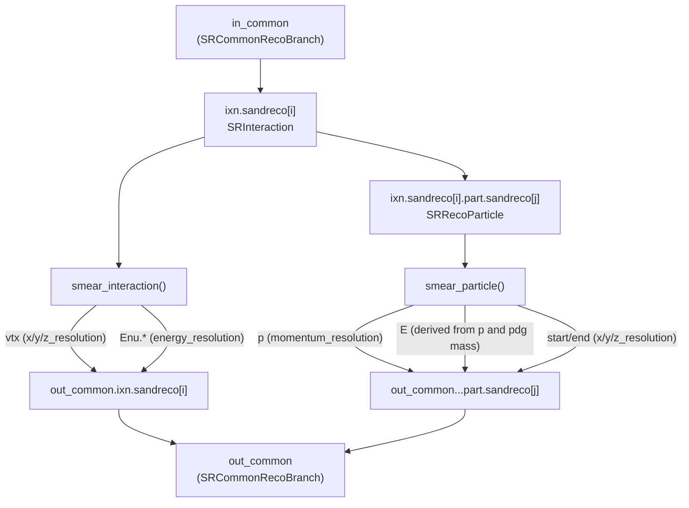

# gauss_smearing

Takes the "perfect" `common_reco_branch_wrapper` produced by `fast_reco` (`in_common`) and
perturbs it with a Gaussian smearing model, producing a degraded `out_common`. The `nd`
branch (tracks/showers) is untouched by this process — smear that separately if needed.

## Data flow

## Configuration

| Parameter Name        | Type   | Unit          | Required/Default | Description                                                     |
|------------------------|--------|---------------|-------------------|-------------------------------------------------------------------|
| `energy_resolution`   | double | dimensionless | Default: 0.0      | `sigma_E = energy_resolution * sqrt(E)` (E in GeV). Used only for the interaction-level `Enu` estimators. |
| `momentum_resolution` | double | dimensionless | Default: 0.0      | `sigma_p = momentum_resolution * \|p\|`. Used for per-particle momentum smearing. |
| `x_resolution`        | double | cm            | Default: 0.0      | Gaussian sigma for the x coordinate of every smeared position.   |
| `y_resolution`        | double | cm            | Default: 0.0      | Gaussian sigma for the y coordinate.                             |
| `z_resolution`        | double | cm            | Default: 0.0      | Gaussian sigma for the z coordinate.                             |

## Notes

- All resolutions default to `0.0`: an unconfigured `gauss_smearing` is a no-op copy of
  `in_common` to `out_common`.
- `smear_interaction()`/`smear_particle()` are free functions, independently testable and
  reused as-is by `run()` — no hidden state beyond the resolutions read in `configure()`.
- `smear_particle()` does not smear `E` independently from `p`: smearing both independently
  would break the mass-shell relation `E^2 = |p|^2 + m^2` for the particle's `pdg`, effectively
  changing its invariant mass. Instead, only `p` is smeared and `E` is derived from the smeared
  `p` and the rest mass looked up from `pdg` via `TDatabasePDG`, so `pdg` and the resulting mass
  always stay consistent. `pdg` codes with no entry in `TDatabasePDG` (e.g.
  `SRRecoParticle::kPdgHadronicBlob`) fall back to a rest mass of `0`.
- Randomness comes from `ufw::context::current()->engine()`, the per-context RNG already
  seeded by the framework; `gauss_smearing` does not own or seed its own engine.
- `smear_interaction()` mirrors `fast_reco`'s choice of collapsing every `Enu` estimator
  (`calo`/`lep_calo`/`mu_range`/...) to the same value — here, the same smeared energy —
  rather than smearing each independently.
