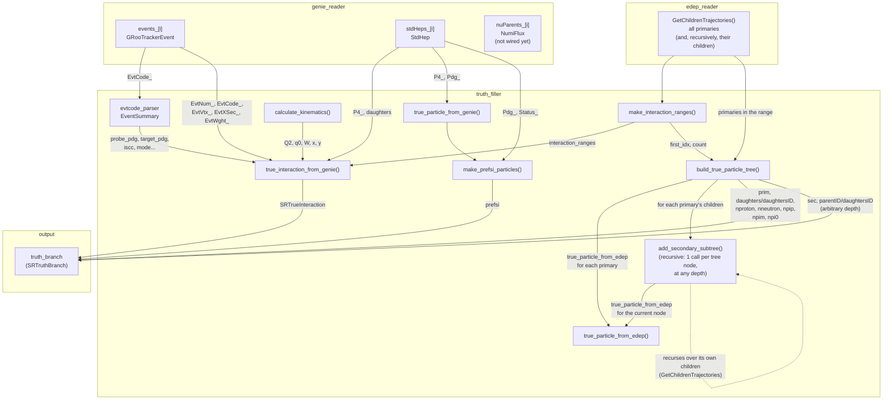

# truth_filler

Reads GENIE (`genie_reader`) and edep-sim (`edep_reader`) and produces
an `SRTruthBranch` (`truth_branch_wrapper`) for downstream CAF consumers (`fast_reco`, `caf_streamer`).

## Data flow

---

## 1. `caf::SRTrueInteraction` — the neutrino vertex

Stored in `truth_branch.nu[i]`. Filled by `filler_details::true_interaction_from_genie()`.

| Field | Type | Source | Units | Notes |
|-------|------|--------|-------|-------|
| **Identifiers** |||||
| `id` | `long int` | `GRooTrackerEvent::EvtNum_` | — | Event number |
| `genieIdx` | `long int` | `GRooTrackerEvent::EvtNum_` | — | Same as `id` |
| **Neutrino probe** |||||
| `pdg` | `int` | `EventSummary::probe_pdg` (from `EvtCode_` `nu:` token) | — | |
| `pdgorig` | `int` | = `pdg` | — | No oscillation for ND |
| `iscc` | `bool` | `interaction_type == "Weak[CC]"` | — | |
| `mode` | `ScatteringMode` | `EventSummary::scattering_type` | — | QE, RES, DIS, MEC, COH… |
| **Target** |||||
| `targetPDG` | `int` | `EventSummary::target_pdg` (from `EvtCode_` `tgt:` token) | — | e.g. Ar-40 = `1000180400` |
| `hitnuc` | `int` | `EventSummary::hit_nucleon_pdg` (from `N:` token) | — | `0` if absent (COH, NC) |
| **Vertex** |||||
| `vtx` | `SRVector3D` | `GRooTrackerEvent::EvtVtx_[0–2]` | **cm** | gRooTracker stores detector coords in cm |
| `time` | `float` | `GRooTrackerEvent::EvtVtx_[3]` | **ns** | |
| `isvtxcont` | `bool` | Hardcoded `true` | — | All SAND vertices are inside the detector |
| **Neutrino energy & momentum** |||||
| `E` | `float` | `StdHep::P4_[StdHepIndex::nu].E()` | **GeV** | |
| `momentum` | `SRVector3D` | `StdHep::P4_[StdHepIndex::nu].Px/Py/Pz()` | **GeV/c** | |
| **Calculated kinematics** (via `calculate_kinematics(nu_p4, lep_p4)`) |||||
| `Q2` | `float` | `−q²`, `q = p_ν − p_ℓ` | **GeV²** | |
| `q0` | `float` | `q.E()` | **GeV** | |
| `modq` | `float` | `q.P()` | **GeV/c** | |
| `W` | `float` | `√(M² + 2·q₀·M + q²)` with `M = TDatabasePDG(2212)→Mass()` | **GeV** | Proton mass ≈ 0.9383; ND_CAFMaker uses `Mnuc = 0.939` |
| `bjorkenX` | `float` | `Q² / (2·M·q₀)` | dimensionless | |
| `inelasticity` | `float` | `q₀ / E_ν` | dimensionless | |
| **GENIE flags** |||||
| `ischarm` | `bool` | `EventSummary::is_charm_event` (from `charm:` token) | — | |
| `isseaquark` | `bool` | `mode == kDIS && EventSummary::hit_sea_quark` | — | |
| `resnum` | `int` | `EventSummary::resonance_type` (from `res:` token) | — | Only for `kRes` |
| **Weights & generator** |||||
| `xsec` | `float` | `GRooTrackerEvent::EvtXSec_` | **1/GeV²** | |
| `genweight` | `float` | `GRooTrackerEvent::EvtWght_` | dimensionless | |
| `generator` | `Generator` | Hardcoded `kGENIE` | — | |
| `xsec_cvwgt` | `float` | Hardcoded `1.0f` | — | Placeholder |
| **Particle counters** (from primaries, via `build_true_particle_tree()`) |||||
| `nproton` | `int` | PDG 2212 count in `prim` | — | |
| `nneutron` | `int` | PDG 2112 count in `prim` | — | |
| `npip` | `int` | PDG 211 (π⁺) count in `prim` | — | |
| `npim` | `int` | PDG −211 (π⁻) count in `prim` | — | |
| `npi0` | `int` | PDG 111 (π⁰) count in `prim` | — | |
| **Particle vectors** |||||
| `nprim` | `int` | `build_true_particle_tree().prim.size()` | — | |
| `prim` | `vector<SRTrueParticle>` | `build_true_particle_tree()` from edep-sim | — | Post-FSI, post-Geant4; each linked to itself via `ancestor_id`, to its direct children via `daughtersID` |
| `nprefsi` | `int` | `make_prefsi_particles().size()` | — | |
| `prefsi` | `vector<SRTrueParticle>` | `make_prefsi_particles()` from GENIE StdHep | — | Status `kIStHadronInTheNucleus`, excluding bindino |
| `nsec` | `int` | `build_true_particle_tree().sec.size()` | — | |
| `sec` | `vector<SRTrueParticle>` | `build_true_particle_tree()` from edep-sim | — | Geant4 descendants of the primaries, **flattened to any depth** (pre-order); each linked to its parent via `parentID`, to its root primary via `ancestor_id`, to its own children via `daughtersID` |

**Filled:** 36 fields

---

## 2. `caf::SRTrueParticle` — a single true particle

### From edep-sim (`true_particle_from_edep`) — used for `prim` and `sec`

| Field | Type | Source | Units | Notes |
|-------|------|--------|-------|-------|
| `pdg` | `int` | `EDEPTrajectory::GetPDGCode()` | — | |
| `G4ID` | `int` | `EDEPTrajectory::GetId()` | — | Geant4 track ID |
| `interaction_id` | `long int` | Parameter (`ixn_id`) | — | |
| `ancestor_id` | `TrueParticleID` | Parameter | — | For `prim`: itself, `{sr_ixn, kPrimary, i}`. For `sec`: the root primary's ID, propagated unchanged through the whole subtree |
| `parent` | `int` | `EDEPTrajectory::GetParentId()` | — | Geant4 parent track ID (raw) |
| `p` | `SRLorentzVector` | `GetInitialMomentum() × 1e−3` | **GeV/c**, **GeV** | edep-sim stores momentum in MeV |
| `time` | `double` | First `TrajectoryPoint::GetPosition().T()` | **ns** | No conversion needed |
| `start_pos` | `SRVector3D` | First `TrajectoryPoint::GetPosition() × 0.1` | **cm** | edep-sim stores positions in mm |
| `end_pos` | `SRVector3D` | Last `TrajectoryPoint::GetPosition() × 0.1` | **cm** | edep-sim stores positions in mm |
| `first_process` | `unsigned int` | First `TrajectoryPoint::GetProcess()` | — | |
| `first_subprocess` | `unsigned int` | First `TrajectoryPoint::GetSubprocess()` | — | |
| `end_process` | `unsigned int` | Last `TrajectoryPoint::GetProcess()` | — | |
| `end_subprocess` | `unsigned int` | Last `TrajectoryPoint::GetSubprocess()` | — | |

**Filled:** 13 fields

### Tree links (`build_true_particle_tree` / `add_secondary_subtree`) — used for `prim` and `sec`

Set *after* `true_particle_from_edep()`, once the node's own `TrueParticleID` and its
children are known. This is what makes the whole event tree navigable at any depth
without ever nesting `SRTrueParticle` objects.

| Field | Type | Source | Notes |
|-------|------|--------|-------|
| `parentID` | `TrueParticleID` | The caller's own ID, passed down before recursing | Left unset (`kUnknown`) for `prim` (no SR parent); set for every `sec` |
| `daughtersID` | `vector<TrueParticleID>` | Return values of the recursive `add_secondary_subtree()` calls on direct children | Direct children only (one level down) |
| `daughters` | `vector<unsigned int>` | `EDEPTrajectory::GetId()` of direct children | Raw Geant4 track IDs, redundant with `daughtersID` but kept for debugging |

**Filled:** 3 fields (on top of the 13 above)

### From GENIE StdHep (`true_particle_from_genie`) — used for `prefsi` only

| Field | Type | Source | Units | Notes |
|-------|------|--------|-------|-------|
| `pdg` | `int` | `StdHep::Pdg_[index]` | — | |
| `G4ID` | `int` | Hardcoded `−1` | — | Not propagated by Geant4 |
| `interaction_id` | `long int` | Parameter (`ixn_id`) | — | |
| `p` | `SRLorentzVector` | `StdHep::P4_[index]` | **GeV/c**, **GeV** | GENIE StdHep stores momenta in GeV |

**Filled:** 4 fields

---

## NOT filled — with reason

### `SRTrueInteraction`

| Field | Reason | 
|-------|--------|
| `removalE` | Not available in gRooTracker format (TODO also in ND_CAFMaker) |
| `t` | Requires `genie::Interaction::Kine().t()` — not in gRooTracker |
| `baseline` | Requires neutrino production vertex — available in `NuParent::DecX4_` |
| `prod_vtx` | Requires flux info — partially available in `NuParent` / `NumiFlux` |
| `parent_pdg` | Available in `NuParent::Pdg_` — not yet wired |
| `parent_dcy_mode` | Available in `NuParent::DecMode_` — not yet wired |
| `parent_dcy_mom` | Available in `NuParent::DecP4_` — not yet wired |
| `parent_dcy_E` | Available in `NuParent::DecP4_` — not yet wired |
| `imp_weight` | Available in `NumiFlux::Nimpwt_` — not yet wired |
| `genVersion` | Not exposed | None |

### `SRTrueParticle`

Nothing left unfilled for `prim`/`sec`: since the `build_true_particle_tree()` refactor,
`parentID`, `daughtersID` and `daughters` are populated for every node in the event tree
(previously only `ancestor_id`/`parent` were set, and the tree wasn't navigable downward).

---

## Unit conversions — verified against ND_CAFMaker

| Quantity | Raw unit | Conversion | Output unit | ND_CAFMaker |
|----------|----------|------------|-------------|-------------|
| edep-sim momentum | MeV | `× 1e−3` | GeV | `traj.InitialMomentum * 0.001` |
| edep-sim position | mm | `× 0.1` | cm | `(p0.Position * .1).Vect()` |
| edep-sim time | ns | none | ns | `p0.Position.T()` |
| GENIE StdHep momentum | GeV | none | GeV | `*p->P4()` |
| GENIE vertex | cm | none | cm | `event→Vertex() × 100` (m→cm) → same output |
| GENIE time | ns | none | ns | `vtx.T()` |

---
