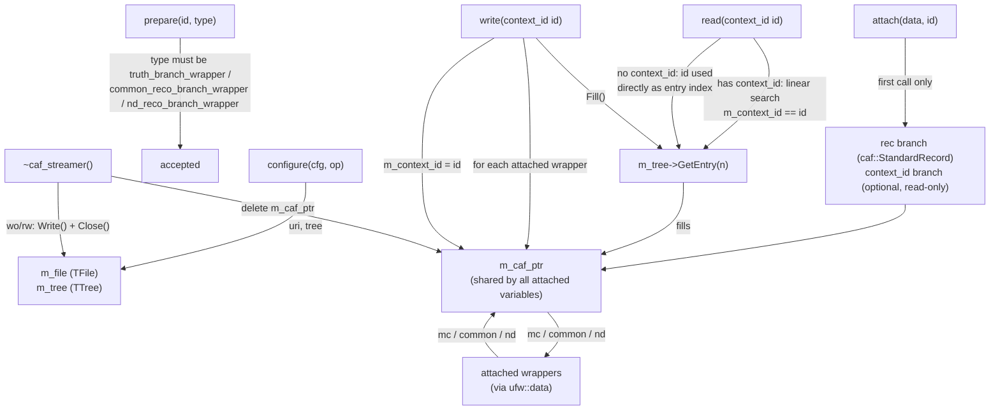

# caf_streamer

Reads/writes CAF (Common Analysis Format) ROOT files: a single `caf::StandardRecord` per
event, stored in the `rec` branch of a configurable TTree, optionally keyed by a
`context_id` branch so it can be composed with producers/consumers that don't use the
entry index as their `ufw::context_id` (e.g. `fast_reco`/`gauss_smearing`/
`gluckstern_smearing` writing `truth`/`common`/`nd` branches in the same run). Every
variable attached to the streamer (`truth_branch_wrapper`, `common_reco_branch_wrapper`,
`nd_reco_branch_wrapper`) reads/writes a different sub-object of that *same* shared
`caf::StandardRecord` (`mc`/`common`/`nd`).

## Data flow

---
